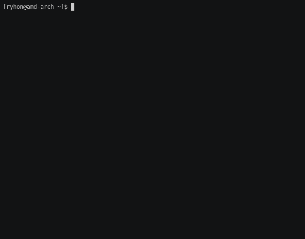

# xp

GUI and TUI music player with support for multiple streaming services.  


## Features
* Gtk4 GUI and TUI
* Downloading music from multiple streaming services. See table below.
* Partial MPRIS implementation (play/pause, seek, quit, see [ddbus#60](https://github.com/trishume/ddbus/issues/60))
### Supported services
| Service | Notes |
|---|---|
| Local files | Metadata provided by `taglib_c` |
| YouTube | |
| Spotify | Audio is downloaded with youtube-dl's `ytsearch:` feature |
| SoundCloud | |

## Building and installing
### Installing
xp is available on the AUR, to install it, use the following command:
```sh
yay -S xp-git yt-dlp yt-dlp-drop-in
```
To run it, run the following command in the terminal:
```sh
# For terminal interface
xp tui

# For gtk4 interface
xp
```
For other platforms, refer to the build instructions below.

### Building
The following dependencies are required for building:
* DUB and D compiler (prefarably LDC2)  

The following runtime dependencies are required:
* SDL2_mixer
* gtk4 and libadwaita
* yt-dlp/youtube-dl
* ffmpeg or avconv
* taglib (taglib_c)
* dbus
* sqlite3
* modest

Commands to install these packages for select platforms:
```sh
# Arch Linux

# Build dependencies
sudo pacman -S dub ldc
# Runtime dependencies
sudo pacman -S liblphobos dbus sdl2_mixer gtk4 libadwaita youtube-dl ffmpeg taglib dbus sqlite3 modest
```
<!--
currently not supported due to lack of modest
```sh
# Ubuntu 22.04

# Build
sudo apt-get install ldc dub
# Runtime
sudo apt-get install libphobos2-ldc-shared98 libsdl2-mixer-2.0-0 libgtk-4-1 libadwaita-1-0 ffmpeg youtube-dl libtag1v5 sqlite dbus
```
-->
Building the program:
```sh
git clone https://github.com/Ryhon0/xp
cd xp
dub build -b release
strip xp
```